Итоговая контрольная работа.

Необходимо организовать систему учета для питомника в котором живут
домашние и вьючные животные.

Как сдавать проект

Для сдачи проекта необходимо создать отдельный общедоступный
репозиторий(Github, gitlub, или Bitbucket). Разработку вести в этом
репозитории, использовать пул реквесты на изменения. Программа должна запускаться и работать, ошибок при выполнении программы быть не должно. Программа, может использоваться в различных системах, поэтому необходимо разработать класс в виде конструктора.

Задание

Операционные системы и виртуализация (Linux)

1. Использование команды cat в Linux

Используя команду cat в терминале операционной системы Linux, создать два файла Домашние животные (заполнив файл собаками, кошками, хомяками) и Вьючные животными (заполнив файл Лошадьми, верблюдами и ослы), а затем объединить их. Просмотреть содержимое созданного файла. Переименовать файл, дав ему новое имя (Друзья человека).
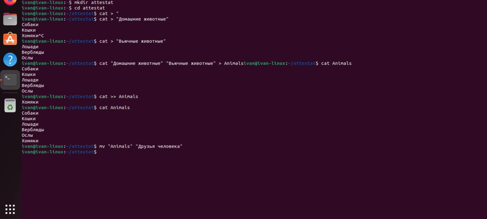

2. Работа с директориями в Linux

Создать новую директорию и переместить туда файл
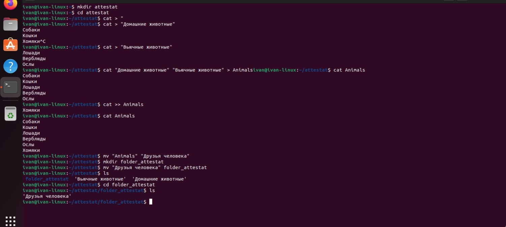

3. Работа с MySQL в Linux. “Установить MySQL на вашу вычислительную машину”

Подключить дополнительный репозиторий MySQL и установить один из пакетов из этого репозитория.
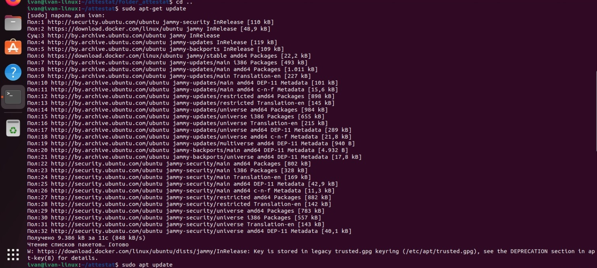

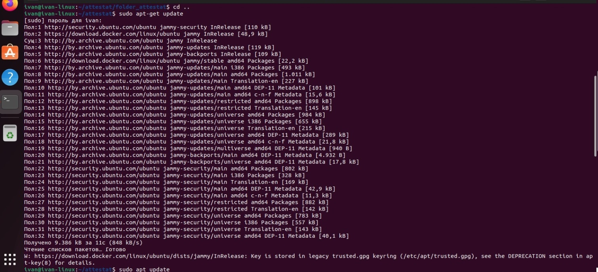

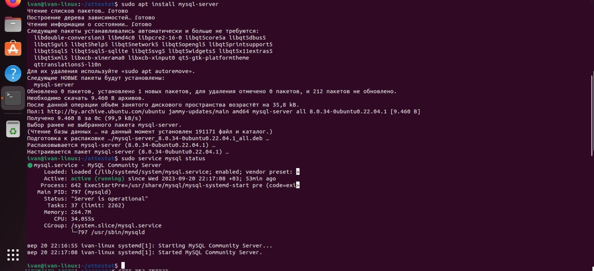

4. Управление deb-пакетами

Установить и затем удалить deb-пакет, используя команду `dpkg`.
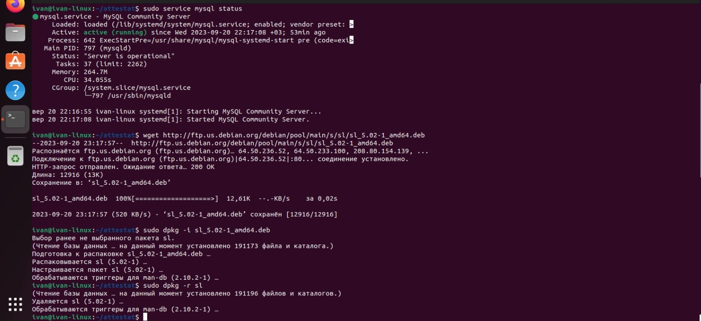

5. История команд в терминале Ubuntu

Сохранить и выложить историю ваших терминальных команд в Ubuntu.
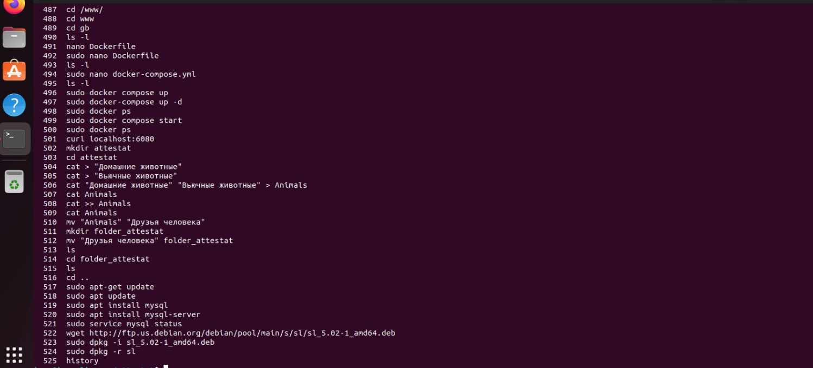

Объектно-ориентированное программирование

6. Нарисовать диаграмму, в которой есть класс родительский класс, домашние животные и вьючные животные, в составы которых в случае домашних животных войдут классы: собаки, кошки, хомяки, а в класс вьючные животные войдут: Лошади, верблюды и ослы.

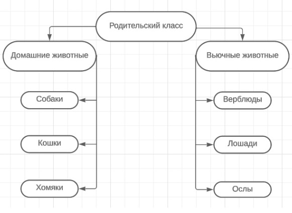

7. В подключенном MySQL репозитории создать базу данных “Друзья человека”

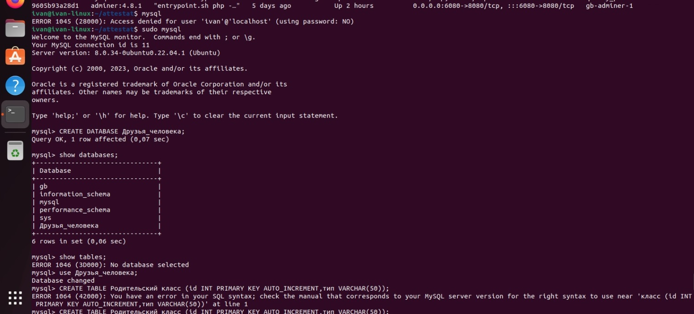

8. Создать таблицы с иерархией из диаграммы в БД

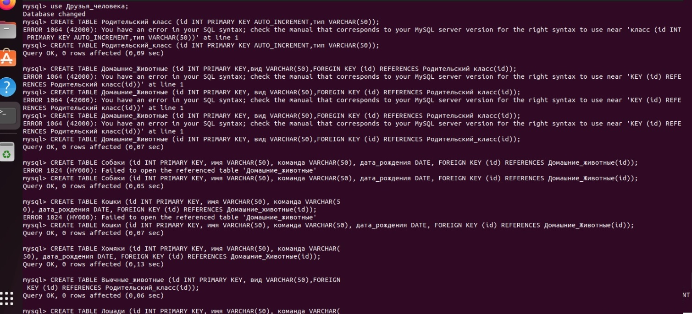

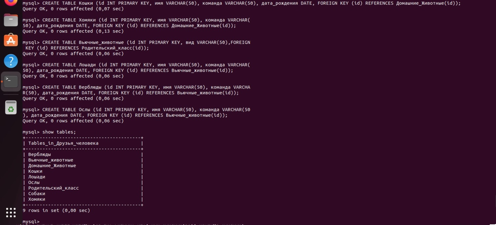

9. Заполнить низкоуровневые таблицы именами(животных), командами
   которые они выполняют и датами рождения

INSERT INTO Верблюды ( имя, команда, дата_рождения)
VALUES ('Зефир', 'Но, пошел', '2019-09-01'),
('Багдад', 'На месте' '2020-11-12'),
('Скорость', 'Ждать' '2021-04-05');

INSERT INTO Кошки ( имя, команда, дата_рождения)
VALUES ('Маркиз', 'Кис-кис', '2021-01-20'),
('Снежка', 'Давай играть', '2022-03-08');

INSERT INTO Лошади ( имя, команда, дата_рождения)
VALUES ('Спирит', 'Но', '2020-01-21'),
('Воронок', 'Бррррр', '2022-03-08');

INSERT INTO Ослы ( имя, команда, дата_рождения)
VALUES ('Нарик', 'Пошёл', '2019-01-21'),
('Степан', 'Стой', '2021-03-08');

INSERT INTO Собаки ( имя, команда, дата_рождения)
VALUES ('Шарик', 'Дай лапу', '2019-01-21'),
('Бим', 'Лежать', '2020-03-08');

INSERT INTO Хомяки ( имя, команда, дата_рождения)
VALUES ('Долгожитель', 'Кушать', '2022-01-21'),
('Хома', 'Отойди', '2023-03-08');

10. Удалив из таблицы верблюдов, т.к. верблюдов решили перевезти в другой питомник на зимовку. Объединить таблицы лошади, и ослы в одну таблицу.

TRUNCATE TABLE Верблюды;

CREATE TABLE Парнокопытные AS
SELECT _ FROM Лошади
UNION
SELECT _ FROM Ослы;

11. Создать новую таблицу “молодые животные” в которую попадут все
    животные старше 1 года, но младше 3 лет и в отдельном столбце с точностью до месяца подсчитать возраст животных в новой таблице

CREATE TABLE Парнокопытные AS

SELECT \*, TIMESTAMPDIFF(MONTH, дата*рождения, CURDATE()) AS возраст*в_месяцах

FROM (

    SELECT 'Собаки' AS тип_животного, имя, команда, дата_рождения FROM Собаки
    UNION ALL

    SELECT 'Кошки' AS тип_животного, имя, команда, дата_рождения FROM Кошки
    UNION ALL

    SELECT 'Хомяки' AS тип_животного, имя, команда, дата_рождения FROM Хомяки
    UNION ALL

    SELECT 'Лошади' AS тип_животного, имя, команда, дата_рождения FROM Лошади
    UNION ALL

    SELECT 'Ослы' AS тип_животного, имя, команда, дата_рождения FROM Ослы

) AS животные

WHERE дата_рождения >= DATE_SUB(CURDATE(), INTERVAL 3 YEAR)

AND дата_рождения <= DATE_SUB(CURDATE(), INTERVAL 1 YEAR);

12. Объединить все таблицы в одну, при этом сохраняя поля, указывающие на прошлую принадлежность к старым таблицам.

CREATE TABLE Полный_состав AS

SELECT 'Собаки' AS тип_животного, имя, команда, дата_рождения FROM Собаки
UNION ALL

SELECT 'Кошки' AS тип_животного, имя, команда, дата_рождения FROM Кошки
UNION ALL

SELECT 'Хомяки' AS тип_животного, имя, команда, дата_рождения FROM Хомяки
UNION ALL

SELECT 'Лошади' AS тип_животного, имя, команда, дата_рождения FROM Лошади
UNION ALL

SELECT 'Ослы' AS тип_животного, имя, команда, дата_рождения FROM Ослы;

13. Создать класс с Инкапсуляцией методов и наследованием по диаграмме.

14. Написать программу, имитирующую работу реестра домашних животных.
    В программе должен быть реализован следующий функционал:

     14.1 Завести новое животное

     14.2 определять животное в правильный класс

     14.3 увидеть список команд, которое выполняет животное

     14.4 обучить животное новым командам

     14.5 Реализовать навигацию по меню

15. Создайте класс Счетчик, у которого есть метод add(), увеличивающий̆ значение внутренней̆ int переменной̆ на 1 при нажатие “Завести новое животное” Сделайте так, чтобы с объектом такого типа можно было работать в блоке try-with-resources. Нужно бросить исключение, если работа с объектом типа счетчик была не в ресурсном try и/или ресурс остался открыт. Значение считать в ресурсе try, если при заведения животного заполнены все поля.
